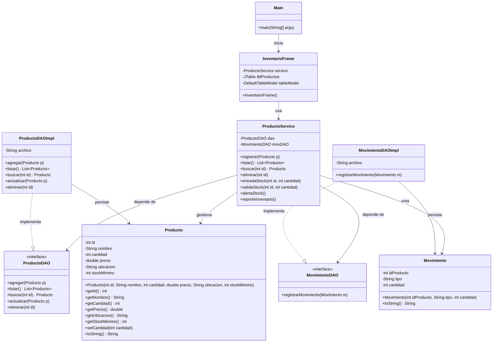

# Diagrama de Clases UML

Este diagrama representa la arquitectura por capas actual del proyecto `InventarioApp`.

## Resumen de relaciones

- `Main` inicia la aplicacion y abre `InventarioFrame`.
- `InventarioFrame` interactua con `ProductoService`.
- `ProductoService` concentra la logica de negocio.
- `ProductoDAO` y `MovimientoDAO` definen contratos de persistencia.
- `ProductoDAOImpl` y `MovimientoDAOImpl` implementan esos contratos usando archivos `.txt`.
- `Producto` y `Movimiento` representan las entidades del dominio.
